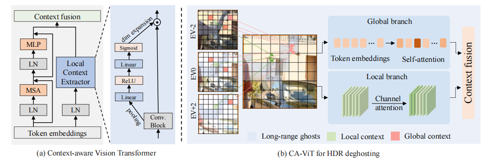
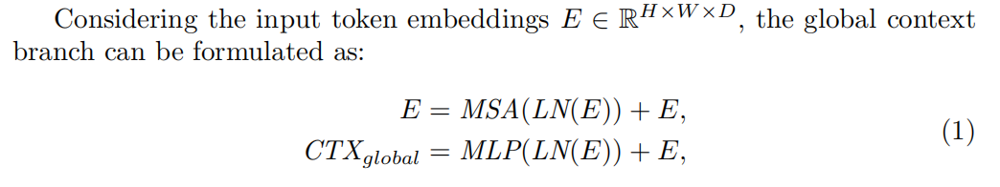
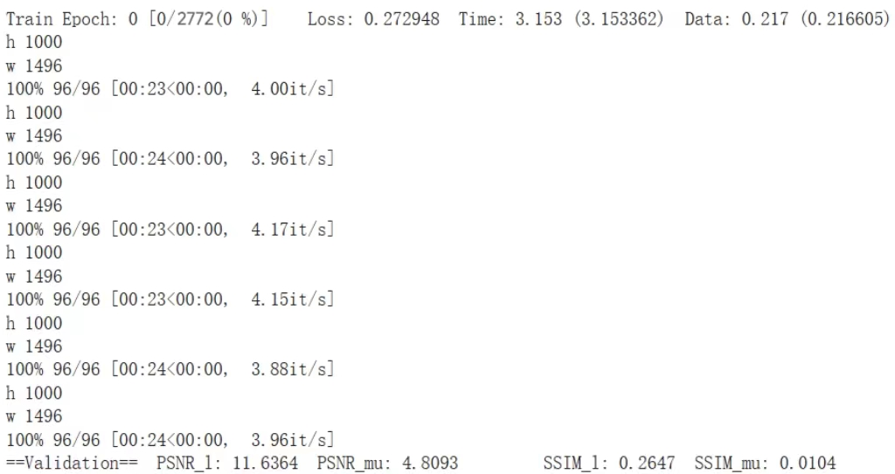
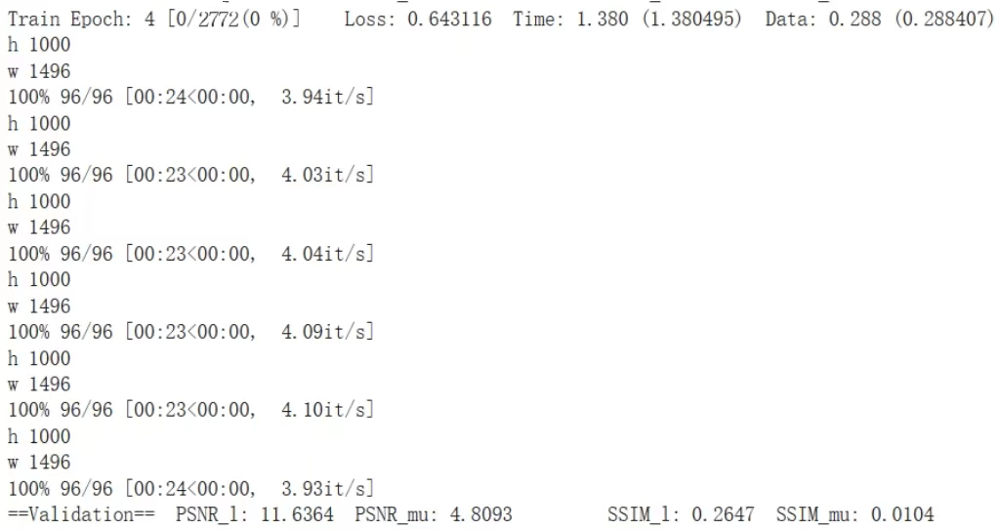
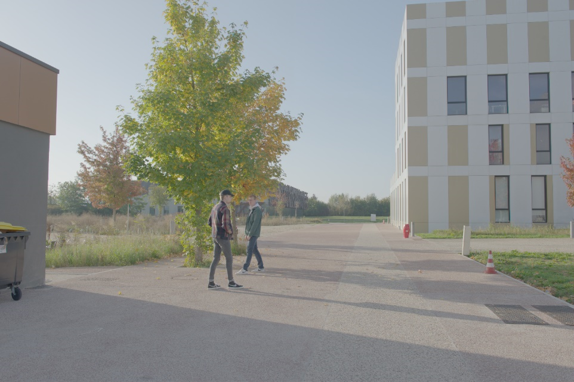
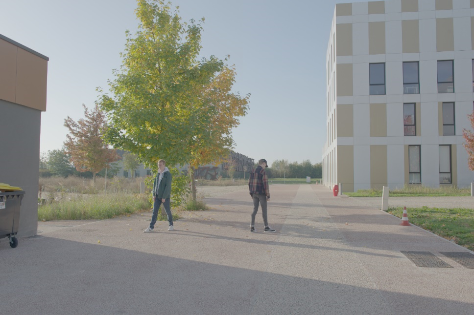

# 1.绪论

​		高动态范围成像（HDR），在计算机图形学与电影摄影术中，是用来实现比普通数位图像技术更大曝光动态范围（即更大的明暗差别）的一组技术。高动态范围成像的目的就是要正确地表示真实世界中从太阳光直射到最暗的阴影这样大的范围亮度。多帧高动态范围成像可以通过将几个不同曝光的低动态范围（LDR）图像对齐、合并，生成具有更宽动态范围和更真实细节的图像。在收集低动态范围图像的过程中，我们发现大多数图片由于摄像机和前景动态对象的运动，在合并高动态范围成像过程中会出现重影。

​		对于如何解决由于移动物体引起的重影问题，已经有了很多经典的方法。比如计算光流来模拟前景运动，然后使用CNN进行多帧融合和HDR重建。但是由于光流方法在多次曝光上的推广性差，这些方法不能产生可靠的结果。通过查找参考资料，视觉Transformer模型也是一种方法，可以在注意力模块的帮助下计算不同图像之间的亲和矩阵。但是传统的Transformer模型存在许多缺点，计算资源需求高，Transformer 模型通常需要大量的计算资源，特别是在处理长序列数据时，可能需要大量的内存和计算时间，而且提取局部上下文效果差。因此我们学习了一种新的HDR-Transformer 模型，主要由特征提取网络和HDR重建网络组成。特征提取网络简单来说通过提取浅层特征，结合空间聚焦模块进行粗融合可以构成。文中提出了一种上下文感知的Transformer 模型（CA-VIT），该模型通过双分支架构同时获得全局和局部特征，全局分支通过基于窗口的多头Transformer 模型编码器来捕获远程上下文，局部分支通过局部上下文提取器（LCE）提取局部特征并进行选择。以CA-ViT为基本组件，可以构成HDR重建网络。

​		在我们学习了原论文的方法后，我们通过改进原论文中提取特征的部分来增强HDR-Transformer模型，我们的**主要贡献**：

​1.通过沿对角线翻转、调整数据的亮度和对比度两种方式来增强数据，以此来提高样本的多样性。

​2.通过构建ResNet18模型来更换原论文中提取特征的方法，但由于时间和GPU资源的问题，我们未能成功实现，希望在未来有机会能继续实现这一方法。

​3.我们结合使用MLP方法重新修改了原论文提取特征的方法，以此来减少特征提取实现的计算量。

4. 我们提出了更深层的特征提取方式，通过实现Swin-Transformer论文中提出的Window Multi-head Self-Attention（W-MSA）方法，以及结合相互注意力和合并注意力机制的方式来提取更深层的特征，以此来提高HDR-Transformer模型的效果。

**视频链接：**

     【中国海洋大学计算机视觉期末项目（基于HDR_Transformer的创新）-哔哩哔哩】 https://b23.tv/Hnl5PhB

# 2.相关工作

​		高动态范围成像的目的就是要正确地表示真实世界中从太阳光直射到最暗的阴影这样大的范围亮度。它主要是通过拍摄或合成多张不同曝光程度的图像，将这些不同曝光的图像进行融合或处理。在融合过程中，利用算法对不同区域的亮度信息进行分析和整合，使得最终合成的图像能够同时保留亮部和暗部的丰富细节，从而极大地扩展了图像的动态范围，展现出更广泛的亮度层次和色彩信息，使得图像看起来更加逼真、生动，具有更强的视觉冲击力。

## 2.1.HDR的相关工作

​		高动态范围成像在合成多张不同曝光程度的图像过程中，会产生对齐的图像出现重影的情况，而HDR去重影的方法就是该领域着重研究的一个方向，我们将现有的HDR去重影算法总结为三类，即运动抑制方法、图像配准方法和基于CNN的方法。Kalantari等人提出了第一个基于CNN的动态场景多帧HDR成像方法。他们使用CNN在将LDR图像与光流对齐后混合它们[1]。吴等人通过将HDR成像公式化为图像平移问题，开发了第一个非基于流的框架[2]。Yan等人没有使用显式比对，而是采用空间注意力模块来解决重影伪影[3]。普拉巴卡尔等人提出了一种用双边引导上采样器生成HDR图像的有效方法[4]，并进一步探索了用于HDR去重影的零镜头和少镜头学习[5]。

## 2.2.该领域最前沿的进展

​		在对图像进行重建的过程中，分为静态场景和动态场景。静态场景的HDR重建，通常使用手工制作的特征或深度特征来按像素合并LDR图像[6]-[11]。

​		近年来，随着深度学习技术的进步，研究人员试图解决从单个LDR图像重建HDR图像的更具挑战性的问题[12]–[15]。例如，Eilertsen等人[12]利用U-Net架构来学习从LDR图像到HDR图像的映射。李等人[27]提出使用GAN从单个LDR图像生成具有多次曝光的LDR图像，然后按像素明智地合并伪多次曝光图像以产生HDR图像。Liu等人[15]提出了一种HDR到LDR图像形成流水线，其包括动态范围裁剪、来自相机响应函数的非线性映射和量化。

​		对于动态场景的HDR重建，虽然多次曝光的LDR图像包含场景的丰富信息，但在图像捕获期间很难避免对象运动。最近基于CNN的方法将HDR重建公式化为从LDR图像到HDR图像的图像翻译问题[16]-[18],[19]。Wu等人[16]首先估计单应变换以对齐LDR图像的背景，然后提出U-Net或ResNet结构来直接学习从LDR图像到高质量HDR图像的映射。Yan等人[17]在融合LDR图像特征的过程中引入了空间注意力，而Yan等人[18]利用非局部块来处理未对齐图像特征的全局上下文。

## 2.3.该领域尚未解决的问题

​		高动态范围成像领域目前仍存在一些未解决的难题，例如：实时处理：如何在实时应用中高效地处理高动态范围图像的采集、合成和显示；图像压缩：高动态范围图像的数据量较大，如何进行有效的压缩和传输；色域映射：如何将不同设备的色域进行准确映射，以确保在各种设备上获得一致的显示效果；动态场景：对于动态场景的高动态范围成像，如何处理快速变化的光照条件；噪声和失真：高动态范围成像可能引入噪声和失真，如何减少这些问题；成本和普及：高动态范围成像的设备和技术成本相对较高，如何降低成本以促进其更广泛的应用。

## 2.4.原论文

​		而我们将更多的注意力放在了图像提取特征方面。ViT[20]已经表明，纯Transformer model可以直接应用于非重叠图像块序列，并且在图像分类任务上表现非常好。刘等人开发了SWIN Transformer model，这是一种分层结构，通过移位窗口方案捕获跨窗口上下文[21]。Chen等人构建了用于低级计算机视觉任务的预训练Transformer模型IPT[22]。梁等人扩展了用于图像恢复的SWIN Transformer model，并提出了SwinIR，在图像超分辨率和去噪方面实现了最先进的性能[23]。

​		在原论文中，作者提出一种新的上下文感知视觉Transformer model（CA-ViT），用于无鬼影高动态范围成像。CA-ViT被设计为双分支架构，可以联合捕获全局和局部依赖关系。具体地，全局分支采用基于窗口的Transformer model编码器来模拟远程对象移动和强度变化，以解决重影。对于局部分支，作者设计了一个局部上下文提取器（LCE）来捕获短程图像特征，并使用通道注意机制来选择提取特征中的信息性局部细节，以补充全局分支。

# 3.方法

## 3.1.原理部分

### 3.1.1. HDR-Transformer

**1. CA-ViT双分支结构**：

​		作者提出了一种双分支上下文感知视觉Transformer model（CA-ViT），可捕获全局和局部图像信息。

（1）CA-ViT被设计为双分支架构（图(a)）：

​		在该架构中，全局分支通过多头Transformer编码器来建模图像上下文之间的远程依赖性，而局部分支则通过局部上下文提取帧内的局部细节和特征关系。

（2）使用CA-ViT进行HDR去鬼影处理的关键（图(b)）：

​		为了消除由于手部大动作引起的残余鬼影（蓝色标记），需要对全局分支中的自注意力进行建模以在鬼影区域中产生合理的内容（红色标记）。同时，可以通过卷积层提取曝光良好且未被遮挡的局部区域（绿色标记），并通过局部分支中的通道注意力进行融合。

**全局Transformer编码器：**对于全局分支，作者采用基于窗口的多头Transformer编码器来捕获长距离信息。Transformer编码器由一个多头自注意力（MSA）模块和具有残差连接的多层感知机组成。公式化表示如下（其中LN表示LayerNorm，CTXglobal表示由Transformer编码器捕获的全局上下文）：

**局部特征提取器：**对于局部分支，设计了一个局部上下文提取器（LCE），从相邻像素中提取局部信息CTX(local)，并选择跨通道特征进行融合。公式化表示为：

​		具体来说，对于用LN层归一化的token embeddings E，首先将它们重塑为H×W×D大小的特征，并使用卷积块来提取局部特征图。然后将局部特征合并为1×1×D的形状，并分别从两个线性层和ReLU和sigmoid激活层来计算逐通道权重ω。然后通过逐通道校准从原始局部特征中选择有用的特征图。

​		其中σ1和σ2表示ReLU和sigmoid层，FC表示线性层。因此，局部上下文分支不仅将局部性添加到Transformer model编码器中，而且还将跨多个帧识别信息最丰富的局部特征以进行特征融合。

​		最后，使用逐元素相加来合并全局和局部上下文，可以减少附加参数的影响。

**2.HDR去重影**

​		深度HDR去重影的任务旨在通过深度神经网络重建无重影的HDR图像。作者提出HDR-Transformer model来处理HDR去重影，而不是像现有的基于CNN的方法那样堆叠非常深的CNN层来获得大的感受野。关键思想是通过专门设计的双分支CA-ViT，可以在全局分支中很好地模拟远程重影，而局部分支有助于恢复细粒度细节。

​		作者将3个LDR图像（即，Ii，i=1，2，3）作为输入，并将中间帧I2作为参考图像。为了更好地利用输入数据，首先使用伽马校正将LDR图像{Ii}映射到HDR域：

​		其中ti表示Ii的曝光时间，γ是γ校正参数，本文将其设置为2.2。然后，将原始LDR图像{Ii}和相应的伽马校正图像{Ii}连接到通道输入{Xi}中。因为LDR图像有助于检测噪声或饱和区域，而伽马校正图像有助于检测未对准。最后，网络Φ(·)定义为：

**3.HDR-Transformer model总体架构**

​		HDR-Transformer model的整体结构主要由两个组件组成，即特征提取网络（图(a)）和HDR重建网络（图(b)）。给定三幅输入图像，首先通过空间注意力模块提取空间特征。然后将提取的较粗特征嵌入并馈送到基于Transformer model的HDR重建网络中，生成重建的无重影HDR图像。

（1）特征提取网络：

​		前期的卷积层有助于稳定Vision Transformers的训练过程。对于输入图像Xi∈R^{H×W×C}，i=1,2,3，首先通过三个单独的卷积层提取稀疏特征，其中C是通道的数量。然后将每个非参考特征（例如f1和f3）与参考特征f2合并，并通过空间注意力模块A计算注意映射mi：

​		其中注意力特征f'被计算为将注意映射mi乘以非参考特征fi，即

​		其中⊙表示各元素相乘。空间注意力模块已被证明可以有效地消除前景对象移动引起的不期望的内容。注意力模块中的卷积层也可以增加对后续Transformer层的关注。

（2）HDR重建网络：

​		HDR重建网络主要由几个上下文感知Transformer块（CTB）组成。第一个CTB的输入f∈R^{H×W×D}是从f1、f2和f3嵌入到token embeddings中的，其中D表示嵌入维度。HDR结果是由N个后续CTB和一个后续卷积块重建的。作者还采用了全局跳转连接来稳定优化过程。

### 3.1.2.数据增强

​		在HDR实验(High Dynamic Range imaging)中，数据增强是一种非常有用的技术。下面是它的几个主要用途:

​		1.提高图像质量和动态范围:通过数据增强技术,可以从单张或多张低动态范围图像中生成一张高动态范围图像。这可以显著提高最终图像的亮度范围、细节表现和色彩饱和度。

​		2.降低噪声和伪影:数据增强能帮助消除由于单张图像曝光不足或过曝而产生的噪点和伪影,从而获得更加清晰细腻的HDR图像。

​		3.提高HDR图像的稳定性:当场景中存在大的亮度差异时,单张图像很难捕捉全部细节。数据增强可以融合多张不同曝光的图像,从而在高光和阴影区域都获得理想的表现。

​		4.扩展HDR应用场景:通过数据增强,可以将HDR成像技术应用到更多场景中,如手机摄影、视频拍摄等,为用户提供更丰富的高质量成像体验。

### 3.1.3.ResNet模型

1.网络结构

​		ResNet网络是参考了VGG19网络，在其基础上进行了修改，并通过短路机制加入了残差单元，如下图所示。变化主要体现在ResNet直接使用stride=2的卷积做下采样，并且用global average pool层替换了全连接层。ResNet的一个重要设计原则是：当feature map大小降低一半时，feature map的数量增加一倍，这保持了网络层的复杂度。从下图中可以看到，ResNet相比普通网络每两层间增加了短路机制，这就形成了残差学习，其中虚线表示feature map数量发生了改变。（这里以ResNet34为例）

​		上图展示的34-layer的ResNet，还可以构建更深的网络如下表所示。从表中可以看到，对于18-layer和34-layer的ResNet，其进行的两层间的残差学习，当网络更深时，其进行的是三层间的残差学习，三层卷积核分别是1x1，3x3和1x1，一个值得注意的是隐含层的feature map数量是比较小的，并且是输出feature map数量的1/4。

2.残差单元

​		ResNet使用两种残差单元，如下图所示。左图对应的是浅层网络，而右图对应的是深层网络。对于短路连接，当输入和输出的维度一致时，可以直接将输入加到输出上。但是当维度不一致时（对应的是维度增加一倍），这就不能直接相加。有两种策略：（1）采用zero-padding增加维度，此时一般要先做一个downsamp，可以采用strde=2的pooling，这样不会增加参数；（2）采用新的映射（projection shortcut），一般采用1x1的卷积，这样会增加参数，也会增加计算量。短路连接除了直接使用恒等映射，当然都可以采用projection shortcut。

3.ResNet的主要作用

​		（1）图像分类：ResNet在ImageNet图像分类挑战中表现出色，大大提高了图像分类的精度。ResNet成为很多计算机视觉任务的基础模型。

​		（2）特征提取：ResNet被广泛用作特征提取器。其预训练模型（例如在ImageNet上训练的模型）可以用来提取图像的高层次特征，这些特征可以用于其他任务，如图像检索、图像生成、图像分割等。

​		（3）迁移学习：通过使用在大规模数据集（如ImageNet）上预训练的ResNet模型，并对特定任务进行微调，可以显著提高小数据集上的任务表现。

### 3.1.4.更深层的特征提取

1.Multi-head Self-Attention(MSA)

​		多头自注意力（Multi-head Self-Attention，简称MSA）模块是 Transformer 架构中的一个核心组件，最初由 Vaswani 等人在论文 "Attention is All You Need" 中提出。它是自注意力机制的一种扩展，目的是增强模型在处理序列数据（如自然语言处理中的句子）时的并行性和表达能力。

​		在自注意力机制中，每个输入位置的信息可以通过关注序列中的其他位置并加权它们的特征来更新。这个过程涉及到计算查询（Query）、键（Key）和值（Value）向量，然后根据查询与键之间的相似度分配权重，最后加权求和值向量以产生输出。这允许模型学习输入序列内部的依赖关系。

​		多头自注意力机制在此基础上更进一步，它将自注意力过程分解为多个“头”（heads），每个头都有自己的查询、键和值矩阵。这意味着模型可以并行地在不同的表示子空间中执行注意力计算，每个头可能关注输入的不同方面或特征维度。

​		Transformer中提出的多头自注意力模块运算公式为：

​		其计算量如下：

2.Windows Multi-head Self-Attention(W-MSA)

​		W-MSA的全称为Windows Multi-head Self-Attention，相较于MSA而言，引入了Widnwos机制。其对比图如下：

​		可以看出，W-MSA是一个窗口化的多头自注意力，与全局自注意力相比，减少了大量的计算量。而从数学计算过程上来分析：W-MSA与MSA总体的计算过程是一致的，区别在于：W-MSA的长宽不再是H和W，而是窗口:M∗M，并且有 HM∗WM个窗口需要计算：

​		所以它的计算量为：

​		从他们公式可以看出区别主要在于两个公式的后半部分：

​		带一点数进去就可以看出W-MSA在计算量上比MSA少很多，这是W-MSA相较于MSA的优势之一。

3.W-MSA的关键优势：

​		（1）内存使用优化：由于自注意力仅限于窗口内，W-MSA减少了需要同时存储在内存中的特征数量，这对于内存受限的环境特别有利，提高了模型在大规模数据集上的训练和推理可行性。

​		（2）保持一定程度的全局信息：尽管W-MSA限制了自注意力的范围，但它通过在不同位置重复该过程，能够在一定程度上保持对全局上下文的理解。特别是结合Shifted Window Multi-Head Self-Attention (SW-MSA)，通过在相邻窗口之间交错移动窗口，可以在不显著增加计算成本的情况下增强窗口间的信息交流。

​		（3）易于并行化：窗口内的自注意力计算可以高度并行化，这在现代硬件（如GPU）上可以进一步加速计算过程。

​		（4）适应性与扩展性：W-MSA的设计使得模型可以根据不同的任务需求调整窗口大小，从而在计算效率和模型表现之间找到更好的平衡点

## 3.2.实现部分

### 3.2.1.数据增强

​		论文中作者使用了旋转和翻转来做数据增强，我们小组想要在原有基础上尝试其他的数据增强方式，看能不能对结果产生好的影响。经过搜索，除了翻转和旋转，HDR 数据增强的方法还包括：色彩调整：改变 HDR 图像的色彩、饱和度或色调。对比度调整：增强或减弱图像的对比度。光照调整：模拟不同的光照条件，例如增加或减少光照强度。噪声添加：向图像添加一定程度的噪声。视角变换：通过改变视角来增加数据的变化性等。

​		这里我们选择在原有基础上增加调整数据样本的亮度和对比度，沿对角线翻转两种方法来做数据增强。

​		通过实验结果证明，增加数据增强的方法提高了HDR成像的效果。

### 3.2.2.利用ResNet提取特征

​		观察到原文的提取特征方式较为简单，我们试图通过现有的ResNet模型来更换提取特征的方法。我们实现了使用ResNet14来提取特征，实现如下（仅展示关键代码）：

​		对应的修改模型的前向传播部分：

​		将原论文实现中提取特征的部分进行替换：

​		我们在colab上运行调试时遇到了很多问题，包括矩阵维度不匹配、GPU资源不够等等，花费了我们很长的时间来解决这些报错，由于课程实验时间有限，我们改变了新的方向实现，我们将会在课程结束后继续修改使用ResNet架构来实现我们想法。

### 3.2.3.改进特征提取

​		原文中，每个卷积层对输入通道数全部进行卷积操作，生成三个不同的特征图；使用空间注意力模块对特征图进行处理，增强特征；最后将三个特征图合并后通过一个卷积层进行进一步特征提取。这一方法对计算资源的要求较高，且内存消耗较大。

​		我们的改进是：将输入通道数分成三份，分别进行卷积操作，然后再合并，最后通过一个MLP层进行特征提取。这样以来每个卷积层处理的通道数大大减少，从而减小了计算量和内存的效率；同时我们结合 Mlp 方法进行特征处理，可以引入更多非线性变换和灵活性。

### 3.2.4.创新更深层的特征提取

​		我们的灵感来源于，在看原作者论文时，文中提到了使用多头自注意力机制（WSA）和残差模块来实现全局分支结构。一开始我们并不了解什么是WSA，在查阅资料的过程中，我们发现了另一个模块，即Swin-Transformer中提出的Window Multi-head Self-Attention模块（W-MSA），发现W-MSA方法相较于MSA方法的计算量大大减少了，于是，我们试图将原文中的MSA方法替换为W-MSA方法来改进模型，通过实验结果证明，改进后的方法得到的HDR效果图相较于原文的效果有所提高。

​		为了模拟不同帧之间的空间关联，我们采用了窗口式多头自我关注机制（W-MSA）。然后，合并的序列被送入空间注意力块，该块包含一层归一化（LN）和窗口式多头感知机（W-MSA）。

​		我们主要实现了以下三个模块：

​		（1）注意力（Attention）模块：基于自注意力机制实现，支持多头注意力，包括查询、键、值的线性变换和注意力权重计算，最后通过投影层输出。

​		（2）相互注意力（Mutual_Attention）模块：用于处理两个输入的注意力计算。使用多头注意力机制和卷积操作来计算查询、键和值，最后通过注意力权重加权求和输出。

​		（3）合并注意力（Merge_Attention）模块：用于合并注意力，结合了两个输入的注意力计算。包括两组查询、键、值的卷积操作和注意力权重计算，最后通过卷积层输出融合的特征。

​		关键代码截图如下：

# 4.结果

## 4.1.HDR-Transformer的结果

​		我们使用的数据集是基于Kalantari17's dataset（链接：https://cseweb.ucsd.edu/viscomp/projects/SIG17HDR/）完成的。由于我们的电脑不支持cuda，于是我们是在colab上进行的本次实验，发现colab上也会限制GPU计算资源，所以我们没有完全训练该数据集，我们将原数据集进行预处理，最后是基于2772张图片进行训练，使用了9个场景的数据集来进行测试。

 		得到的图片效果如下，这里仅展示了其中三个场景得到的效果图，其余测试集结果可在我们的github上查看：

 

 

## 4.2.我们的Improve-HDR的结果 

​		基于我们改进后的模型，我们使用的训练集和测试集同HDR-Transformer的相同，训练过程展示(部分)如下：

​		得到的效果图如下，这里仅展示了三个场景得到的效果图，其余测试集结果可在我们的github上查看：

 

 

# 5.总结和讨论

​		 **收获和思考：**通过本次实验的学习，我们学习并了解到了高动态范围(HDR)图像的研究并不像我们最开始做的HDR实验那样简单，在动态场景中，从多个低动态范围(LDR)曝光中合成高动态范围图像存在很多困难。前景物体的运动会涉及到两大问题，一是LDR图像之间的严重错位；另一个问题是由于物体移动引起的过饱和或不饱和区域而导致的内容缺失，这可能不易被LDR图像补偿解决。因此，它需要HDR生成模型能够正确地融合LDR图像，并在不产生伪影的情况下恢复缺失的细节。

​		在实验的开始，针对如何重建HDR图像，我们查阅了许多资料，也尝试了许多方向，比如：根据色调映射函数的特性通过多项式构建模型来描述色调曲线的趋势；两种不同分辨率下运行的高效双分支网络；基于GAN模型提出的HDR-GAN，用于从多曝光的LDR图像中合成HDR图像等等。最终我们选择了使用CA-ViT双分支架构，构成的新的HDR-Transformer 模型，基于此来完成我们的本次实验。

​		在本次实验中，我们的**主要贡献**在于以下几个方面：

​		1.我们通过将图片进行沿对角线翻转和调整数据样本的亮度和对比度两种方式来增强数据，以此提高样本的多样性和模型的泛化能力。

​		2.我们使用ResNet18网络来替换原论文中提取特征的方式，但由于时间和GPU资源有限的问题，我们未能成功实现，希望在未来有机会能继续实现这一方法。

​		3.我们结合使用MLP方法重新修改了原论文提取特征的方法，以此来减少特征提取实现的计算量。

​		4.我们提出了更深层的特征提取方式，通过实现Swin-Transformer论文中提出的Window Multi-head Self-Attention（W-MSA）方法，以及结合相互注意力和合并注意力机制的方式来提取更深层的特征，以此来提高HDR-Transformer模型的效果。

​		实验结果证明，在我们的改进下得到的HDR图像相较于原论文HDR-Transformer中的效果有所改进。

​		**未来展望**：我们认为使用成熟的ResNet模型来提取特征更有助于提高最终的实现效果，但由于时间原因我们没有完成这一部分，希望我们可以在未来实现将ResNet模型引入到HDR图像生成中，以此来得到更好的HDR成像。以及我们学习如何重建HDR图像时了解到了有学者基于生成对抗网络提出了HDR-GAN方法来实现，并且取得了不错的效果，将GAN运用到HDR图像重建上我们认为是一个很新颖的方法，我们将会在课下继续学习相关知识了解更多的方法来开拓我们的思路。

# 6.个人贡献声明

​		朱佳雨（40%）：查找论文、跑通原论文方法、提出并实现ResNet模型代替原文提取特征方法、以及基于W-MSA实现更深层次的特征提取方法、撰写报告。

​		张寒（35%）：查找论文、跑通原论文方法、提出并实现数据增强方法、以及结合MLP方法更换特征提取方法、撰写报告。

​		袁佳慧（25%）：查找论文、跑通原论文方法、撰写报告、录制视频、视频PPT。

# 7.引用参考

[1].Kalantari, N.K., Ramamoorthi, R.: Deep high dynamic range imaging of dynamic scenes. ACM Trans. Graphics 36(4), 144 (2017) 2, 4, 7, 9, 10, 11, 12, 13

[2].Wu, S., Xu, J., Tai, Y.W., Tang, C.K.: Deep high dynamic range imaging with large foreground motions. In: Proc. ECCV. pp. 117–132 (2018) 2, 4, 7, 9, 10, 11,12, 13

[3].Yan, Q., Gong, D., Shi, Q., Hengel, A.v.d., Shen, C., Reid, I., Zhang, Y.: Attention guided network for ghost-free high dynamic range imaging. In: Proc. CVPR. pp. 1751–1760 (2019) 2, 4, 7, 8, 9, 10, 11, 12, 13

[4].Prabhakar, K.R., Agrawal, S., Singh, D.K., Ashwath, B., Babu, R.V.: Towards practical and efficient high-resolution hdr deghosting with cnn. In: Proc. ECCV.pp. 497–513. Springer (2020) 2, 4

[5].Prabhakar, K.R., Senthil, G., Agrawal, S., Babu, R.V., Gorthi, R.K.S.S.: Labeled from unlabeled: Exploiting unlabeled data for few-shot deep hdr deghosting. In:Proc. CVPR. pp. 4875–4885 (2021) 2, 4

[6].N. Barakat, A. N. Hone, and T. E. Darcie, “Minimal-bracketing sets for high-dynamic-range image capture,” IEEE TIP, 2008.

[7] S. W. Hasinoff, F. Durand, and W. T. Freeman, “Noise-optimal capture for high dynamic range photography,” in CVPR, 2010.

[8] K. Seshadrinathan, S. H. Park, and O. Nestares, “Noise and dynamic range optimal computational imaging,” in ICIP, 2012.

[9] R. Pourreza-Shahri and N. Kehtarnavaz, “Exposure bracketing via automatic exposure selection,” in ICIP, 2015.

[10] K. R. Prabhakar, V. S. Srikar, and R. V. Babu, “DeepFuse: A deep

unsupervised approach for exposure fusion with extreme exposure image

pairs.” in ICCV, 2017, pp. 4724–4732.

[11].P. v. Beek, “Improved image selection for stack-based HDR imaging,”Electronic Imaging, 2019.

[12].“HDR image reconstruction from a single exposure using deep CNNs,”

ACM TOG, 2017.

[13] S. Lee, G. Hwan An, and S.-J. Kang, “Deep recursive HDRI: Inverse

tone mapping using generative adversarial networks,” in ECCV, 2018.

[14] Z. Khan, M. Khanna, and S. Raman, “FHDR: HDR image reconstruction

from a single LDR image using feedback network,” in Global SIP, 2019.

[15] Y.-L. Liu, W.-S. Lai, Y.-S. Chen, Y.-L. Kao, M.-H. Yang, Y.-Y. Chuang,and J.-B. Huang, “Single-image HDR reconstruction by learning to reverse the camera pipeline,” in CVPR, 2020.

[16].S. Wu, J. Xu, Y.-W. Tai, and C.-K. Tang, “Deep high dynamic range

imaging with large foreground motions,” in ECCV, 2018.

[17] Q. Yan, D. Gong, Q. Shi, A. van den Hengel, C. Shen, I. Reid, and

Y. Zhang, “Attention-guided network for ghost-free high dynamic range

imaging,” in CVPR, 2019.

[18] Q. Yan, L. Zhang, Y. Liu, Y. Zhu, J. Sun, Q. Shi, and Y. Zhang, “Deep HDR imaging via a non-local network,” IEEE TIP, 2020.

[19] Q. Yan, D. Gong, P. Zhang, Q. Shi, J. Sun, I. Reid, and Y. Zhang

“Multi-scale dense networks for deep high dynamic range imaging,” in

WACV, 2019.

[20].Dosovitskiy, A., Beyer, L., Kolesnikov, A., Weissenborn, D., Zhai, X., Unterthiner, T., Dehghani, M., Minderer, M., Heigold, G., Gelly, S., et al.: An image is worth 16x16 words: Transformers for image recognition at scale. arXiv preprint arXiv:2010.11929 (2020) 3, 5, 6

[21]. Liu, Z., Lin, Y., Cao, Y., Hu, H., Wei, Y., Zhang, Z., Lin, S., Guo, B.: Swin transformer: Hierarchical vision transformer using shifted windows. In: Proc. ICCV. pp.10012–10022 (2021) 

[22].Chen, H., Wang, Y., Guo, T., Xu, C., Deng, Y., Liu, Z., Ma, S., Xu, C., Xu, C., Gao, W.: Pre-trained image processing transformer. In: Proc. CVPR. pp. 12299–12310(2021)

[23].Liang, J., Cao, J., Sun, G., Zhang, K., Van Gool, L., Timofte, R.: Swinir: Image restoration using swin transformer. In: Proc. ICCVW. pp. 1833–1844 (2021) 3, 5,10, 12, 13

[24]L. Bogoni. Extending dynamic range of monochrome and color images through fusion. In ICPR, pages 7–12 vol.3,2000. 1, 2

[25]Sing Bing Kang, Matthew Uyttendaele, Simon Winder, and Richard Szeliski. High dynamic range video. ACM TOG, 22(3):319–325, jul 2003. 1, 2

[26]Dosovitskiy, A., Beyer, L., Kolesnikov, A., Weissenborn, D., Zhai, X., Unterthiner, T., Dehghani, M., Minderer, M., Heigold, G., Gelly, S., et al.: An image is worth 16x16 words: Transformers for image recognition at scale. arXiv preprint arXiv:2010.11929 (2020) 3, 5, 6

[27]Liang, J., Cao, J., Sun, G., Zhang, K., Van Gool, L., Timofte, R.: Swinir: Image restoration using swin transformer. In: Proc. ICCVW. pp. 1833–1844 (2021) 3, 5, 10, 12, 13

[28]Zhen Liu, Yinglong Wang, Bing Zeng, and Shuaicheng Liu. Ghost-free high dynamic range imaging with context-aware transformer. In ECCV, 2022.

[29]Steven Tel, Zongwei Wu, Yulun Zhang,Barthelemy Heyrman. Alignment-free HDR Deghosting with Semantics Consistent Transformer.

[30]Nima Khademi Kalantari, Ravi Ramamoorthi, et al. Deep high dynamic range imaging of dynamic scenes. ACM TOG, 36(4):144–1, 2017. 1, 2, 3, 4, 5, 6, 7
